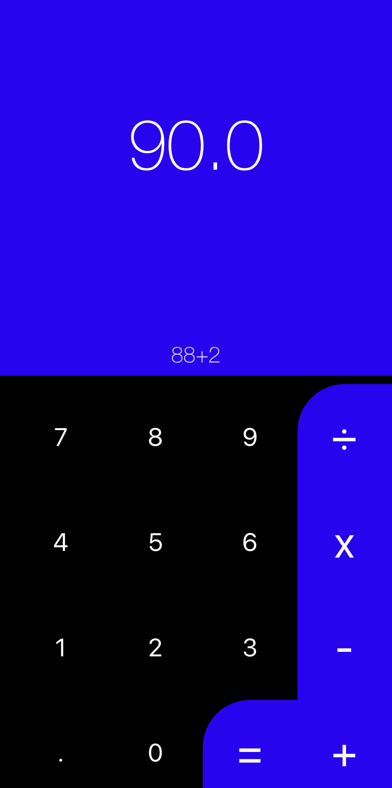

# SwiftUI-Calculator

# About
Followed the SwiftUI Recipe from user [Ajeet Kumar here on Medium](https://medium.com/digital-curry/how-i-created-a-beautiful-calculator-in-less-than-200-loc-with-swiftui-f1640504a50d). This is a simple Calculator that accepts user input and outputs a number. This project makes use of "masks" and uses a custom masking function to create rounded corners on the Operators based on the work of [github user Adrian Hall](https://adrianhall.github.io/swift/2020/05/03/swiftui-masks/).

# Current Issues
* The Calculator does not hold the users value once "=" is pressed. This results in any new digits entered being treated as a new calculation.
* It does not currently produce negative numbers

# Ideas for a next iteration
* Ensure the previous calculation is held so the user can continue calculations as needed. Ex. 9 + 9 = 18. If I press + 2, the output should show 20. Currently will only show 2 and await a second number as it is a new Calculation.
* Add a "clear" button
* Ensure calculator can produce negative numbers.
* Change layout so there is only one line that changes. Currently there are two lines within the VStack, one that is updated with the output of the operand and one that shows a live view of the calculation until "=" is pressed. I would combine the two.
* Increase the sizing of the buttons and decrease the size of the output view.